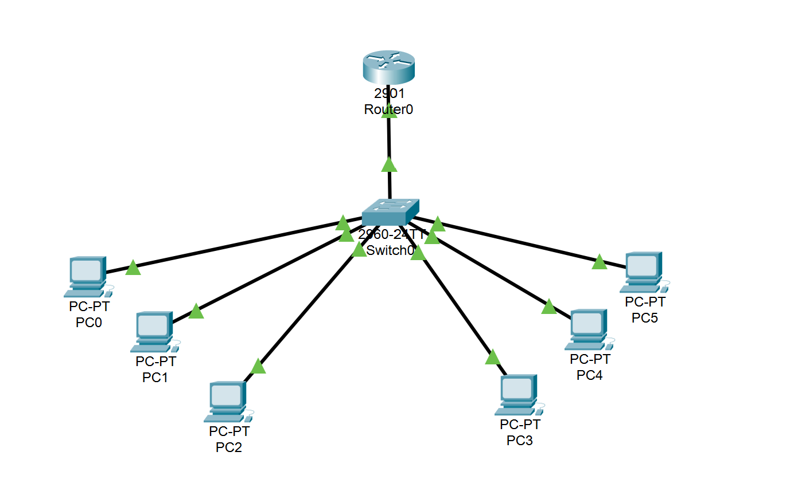
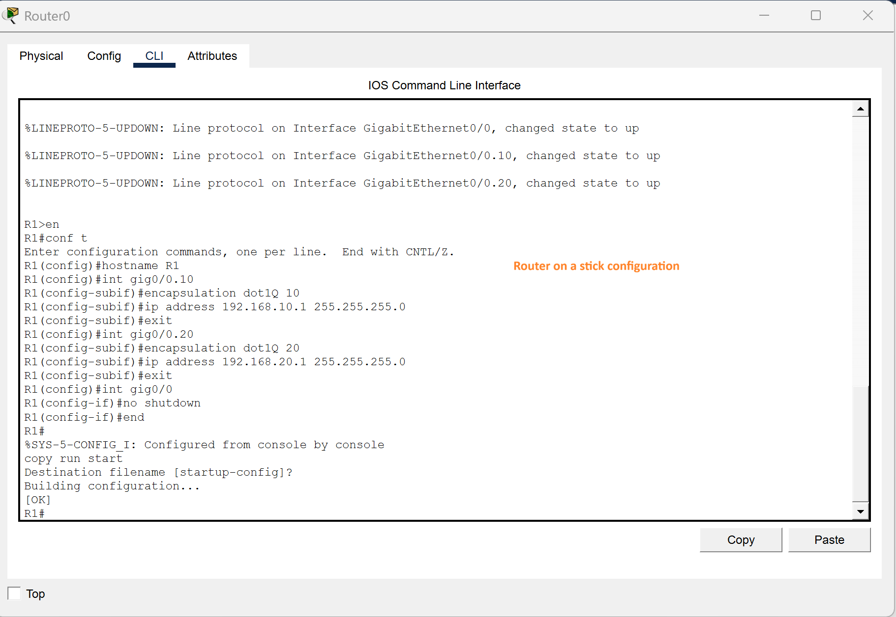
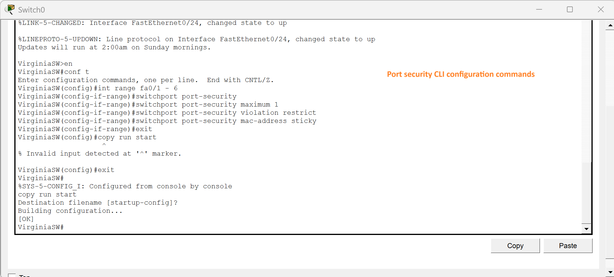
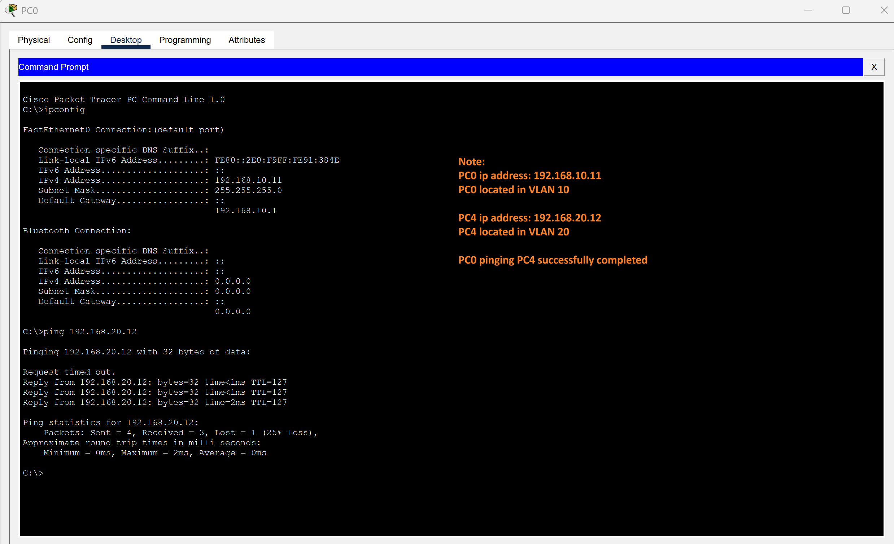

# Network Segmentation & Access Control Lab
**Tools:** Cisco Packet Tracer | Cisco IOS | VLANs | Inter-VLAN Routing | Port Security

## Overview
Configured a segmented network where two departments operate in isolated VLANs and communicate only through a controlled routing path, with unauthorized devices actively blocked at the port level.

## What I Built
- Segmented two departments into separate VLANs (VLAN 10 and VLAN 20) to contain broadcast traffic and enforce department-level isolation
- Configured a trunk port to carry both VLANs across a single uplink to the router
- Implemented Router-on-a-Stick using subinterfaces with dot1Q encapsulation, assigning each VLAN its own gateway so all cross-department traffic passes through a single controlled routing point
- Enabled port security on all access ports, limiting each port to one MAC address, using sticky learning to authorize legitimate devices, and setting violation mode to restrict to drop unauthorized traffic without shutting the port down

## Skills Demonstrated
Cisco IOS | VLANs | Network Segmentation | Inter-VLAN Routing | Port Security | Access Control | Trunking | Defensive Network Design

## Screenshots
### 1. Network Topology

### 2. Router-on-a-Stick Configuration

### 3. Port Security Configuration

### 4. Inter-VLAN Ping Test

